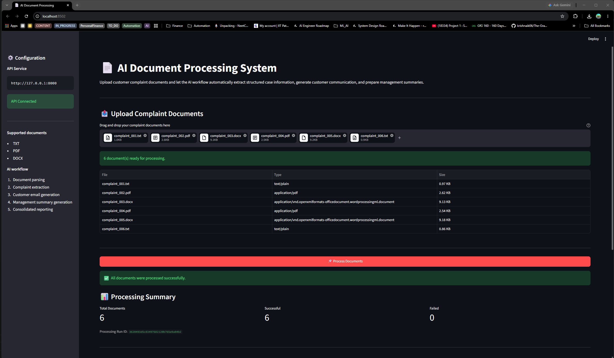
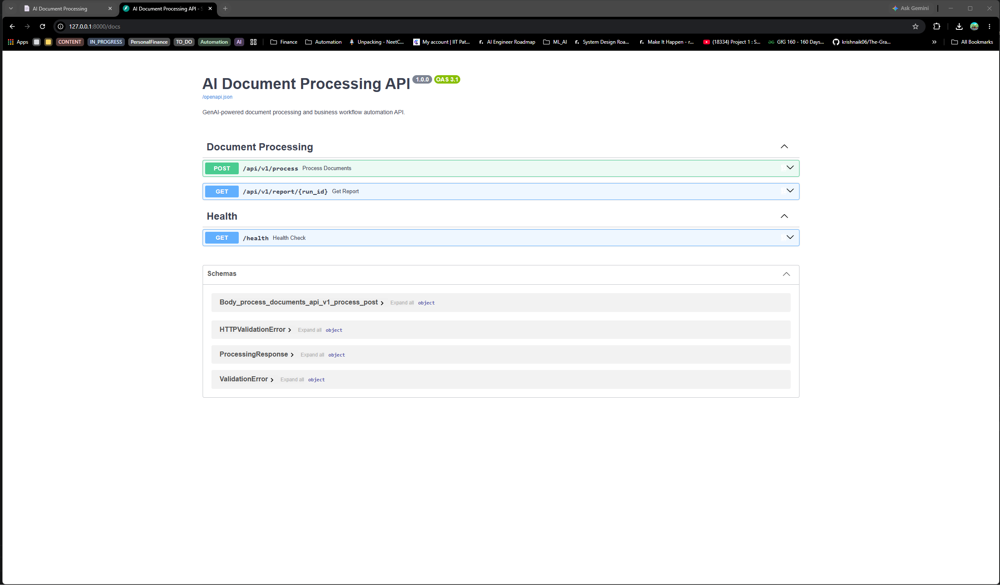
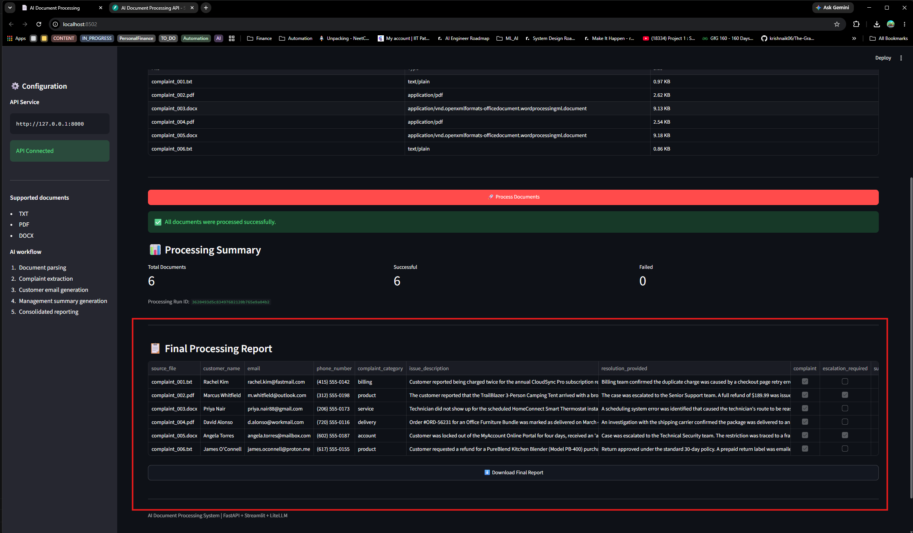
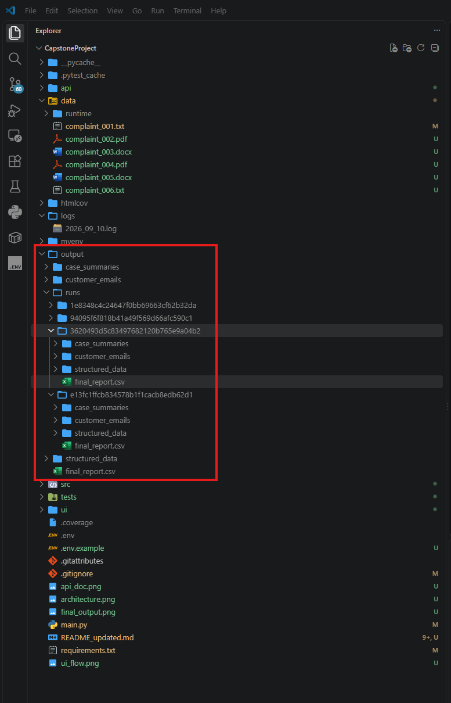
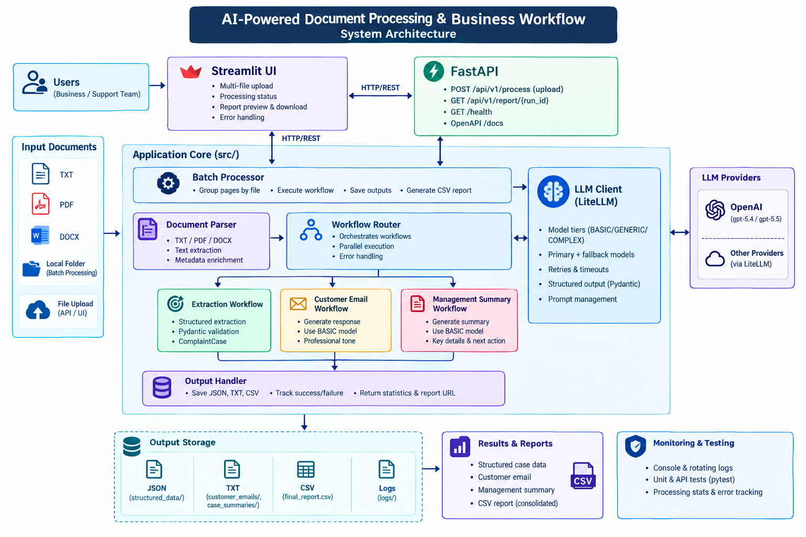

# 🤖 AI-Powered Document Processing & Business Workflow

> **GenAI Capstone Project — Automated Customer Complaint Processing**

An end-to-end GenAI application that transforms customer complaint documents into **structured case data, customer responses, management summaries, and consolidated reports**.

The system supports **batch processing, REST APIs, and a Streamlit web interface**, with structured LLM outputs, validation, retries, fallback models, logging, and per-document error handling.

---

## ✨ What It Does

```text
Customer Complaint
       │
       ▼
┌─────────────────────┐
│ Document Processing │
│ TXT / PDF / DOCX   │
└──────────┬──────────┘
           │
           ▼
┌─────────────────────┐
│   LLM Extraction    │
│ Structured Case    │
└──────────┬──────────┘
           │
      Pydantic Validation
           │
      ┌────┴─────┐
      ▼          ▼
 Customer      Management
  Response      Summary
      │          │
      └────┬─────┘
           ▼
   JSON / TXT / CSV
```

### Key Capabilities

* 📄 Process **TXT, PDF, and DOCX** complaint documents
* 🧠 Extract structured complaint information using an LLM
* ✅ Validate extracted data using **Pydantic**
* 📧 Generate customer-facing response emails
* 📋 Generate internal management summaries
* 🔄 Retry failed LLM requests with model fallback
* 📊 Generate consolidated CSV processing reports
* 🚦 Track success and failure **per document**
* 🌐 Expose processing through **FastAPI**
* 🖥️ Provide a **Streamlit UI**
* 📝 Maintain console and rotating file logs

---

## 🎥 Project Demo
Demo Link - https://github.com/MayankJ0SHI/CapstoneProject/blob/main/demo/demo.mp4
Download it to watch

## 📷 Snapshots









# 🏗️ Architecture



```text
                       ┌──────────────────────┐
                       │   Input Documents    │
                       │   TXT / PDF / DOCX  │
                       └──────────┬───────────┘
                                  │
                                  ▼
                       ┌──────────────────────┐
                       │   Document Parser    │
                       │ Text Extraction      │
                       └──────────┬───────────┘
                                  │
                                  ▼
                       ┌──────────────────────┐
                       │   Batch Processor    │
                       └──────────┬───────────┘
                                  │
                                  ▼
                       ┌──────────────────────┐
                       │   LLM Extraction     │
                       │  ComplaintCase       │
                       └──────────┬───────────┘
                                  │
                                  ▼
                       ┌──────────────────────┐
                       │ Pydantic Validation  │
                       └──────────┬───────────┘
                                  │
                     ┌────────────┴────────────┐
                     │                         │
                     ▼                         ▼
          ┌──────────────────┐      ┌──────────────────┐
          │ Customer Email   │      │ Management       │
          │ Generation       │      │ Summary          │
          └─────────┬────────┘      └─────────┬────────┘
                    │                         │
                    └────────────┬────────────┘
                                 ▼
                       ┌──────────────────────┐
                       │      Outputs         │
                       │ JSON / TXT / CSV     │
                       └──────────────────────┘
```

---

# 🧩 Core Components

| Component              | Responsibility                                      |
| ---------------------- | --------------------------------------------------- |
| **DocumentParser**     | Loads TXT, PDF and DOCX files and extracts text     |
| **BatchProcessor**     | Coordinates processing and creates final reports    |
| **CaseWorkflowRouter** | Controls extraction → email → summary workflow      |
| **LLMClient**          | LiteLLM integration, retries, fallback and timeouts |
| **ComplaintCase**      | Pydantic model for validated complaint data         |
| **FastAPI**            | REST API for document processing                    |
| **Streamlit**          | Browser-based processing interface                  |

---

# 📁 Project Structure

```text
CapstoneProject/
│
├── main.py
├── requirements.txt
├── .env.example
├── architecture.png
│
├── data/
│   ├── input/
│   │   └── complaints/
│   └── runtime/
│
├── output/
├── logs/
│
├── api/
│   ├── main.py
│   ├── schemas.py
│   └── routes/
│       └── processing.py
│
├── ui/
│   └── streamlit_app.py
│
├── src/
│   ├── app.py
│   │
│   ├── config/
│   │   └── models.yaml
│   │
│   ├── llm/
│   │   └── client.py
│   │
│   ├── logger/
│   │   └── logging_config.py
│   │
│   ├── models/
│   │   └── complaint.py
│   │
│   ├── parser/
│   │   └── document_parser.py
│   │
│   ├── processors/
│   │   └── batch_processor.py
│   │
│   ├── prompts/
│   │   ├── extraction.py
│   │   ├── email.py
│   │   └── summary.py
│   │
│   └── services/
│       ├── extraction.py
│       ├── email_generator.py
│       ├── summary_generator.py
│       └── workflow_router.py
│
└── tests/
    ├── test_parser.py
    ├── test_models.py
    ├── test_llm.py
    ├── test_services.py
    ├── test_processor.py
    └── test_api.py
```

---

# 🛠️ Technology Stack

| Technology                 | Purpose                           |
| -------------------------- | --------------------------------- |
| **Python 3.11+**           | Application development           |
| **LiteLLM**                | LLM integration and model routing |
| **FastAPI**                | REST API                          |
| **Streamlit**              | Web interface                     |
| **Pydantic**               | Structured data validation        |
| **PyPDF**                  | PDF text extraction               |
| **python-docx / docx2txt** | DOCX processing                   |
| **Pandas**                 | CSV/report generation             |
| **PyYAML**                 | Model configuration               |
| **Pytest**                 | Automated testing                 |
| **Uvicorn**                | API server                        |

---

# ⚙️ Environment Setup

Create a `.env` file in the project root.

### `.env`

```dotenv
OPENAI_API_KEY=s

API_BASE_URL=http://127.0.0.1:8000

INPUT_DIR=data/input/complaints
OUTPUT_DIR=output
```

> Replace `OPENAI_API_KEY=s` with your actual API key.

### Configuration Variables

| Variable         | Purpose                            |
| ---------------- | ---------------------------------- |
| `OPENAI_API_KEY` | API key used by LiteLLM            |
| `API_BASE_URL`   | FastAPI base URL used by Streamlit |
| `INPUT_DIR`      | Default batch input directory      |
| `OUTPUT_DIR`     | Generated output directory         |

**Never commit `.env` or API keys to Git.**

---

# 🚀 Installation

### 1. Create virtual environment

```powershell
python -m venv myenv
```

### 2. Activate it

```powershell
.\myenv\Scripts\Activate.ps1
```

### 3. Upgrade pip

```powershell
python -m pip install --upgrade pip
```

### 4. Install dependencies

```powershell
pip install -r requirements.txt
```

### 5. Create environment file

```powershell
Copy-Item .env.example .env
```

Update `.env` with your API key and configuration.

---

# ▶️ Running the Application

## Option 1 — Batch Processing

Place complaint documents inside:

```text
data/
```

Supported formats:

```text
.txt
.pdf
.docx
```

Run:

```powershell
python main.py
```

The system processes every supported document and generates the final report.

---

## Option 2 — FastAPI

Start the API:

```powershell
uvicorn api.main:app --reload
```

API:

```text
http://127.0.0.1:8000
```

Swagger documentation:

```text
http://127.0.0.1:8000/docs
```

---

## Option 3 — Streamlit

Start FastAPI first, then open another terminal:

```powershell
streamlit run ui/streamlit_app.py
```

The Streamlit interface allows users to:

1. Upload complaint documents
2. Start processing
3. View processing results
4. Review generated outputs
5. Download the consolidated report

---

# 🔌 API

## Health Check

### `GET /health`

Example:

```json
{
  "status": "healthy",
  "service": "ai-document-processing-api"
}
```

---

## Process Documents

### `POST /api/v1/process`

Upload one or more complaint documents.

Example:

```powershell
curl.exe -X POST "http://127.0.0.1:8000/api/v1/process" `
  -F "files=@data/input/complaints/complaint_001.txt"
```

Example response:

```json
{
  "run_id": "8f2e0a...",
  "status": "completed",
  "total": 1,
  "successful": 1,
  "failed": 0,
  "report_url": "/api/v1/report/8f2e0a..."
}
```

Possible statuses:

```text
completed
completed_with_errors
failed
```

---

## Download Report

### `GET /api/v1/report/{run_id}`

Example:

```powershell
curl.exe -OJ "http://127.0.0.1:8000/api/v1/report/<run_id>"
```

---

# 🧠 LLM Processing Workflow

Each complaint follows this workflow:

```text
Document
   │
   ▼
Text Extraction
   │
   ▼
LLM Structured Extraction
   │
   ▼
Pydantic Validation
   │
   ├───────────────┐
   ▼               ▼
Customer Email   Management Summary
   │               │
   └───────┬───────┘
           ▼
      Save Outputs
           │
           ▼
      Update CSV
```

### Processing Principles

The prompts instruct the model to:

* Use only information available in the source document.
* Avoid inventing customer information.
* Avoid inventing dates, actions or resolutions.
* Return structured information where required.
* Clearly identify missing information.

---

# 🤖 Model Configuration

Models are configured in:

```text
src/config/models.yaml
```

Example:

```yaml
llm:
  timeout: 60
  max_retries: 2

models:
  basic:
    primary: openai/gpt-5.4-mini
    fallback: openai/gpt-5.4

  generic:
    primary: openai/gpt-5.4
    fallback: openai/gpt-5.4-mini

  complex:
    primary: openai/gpt-5.5
    fallback: openai/gpt-5.4
```

The application uses:

* **Primary model** for normal processing
* **Fallback model** when the primary model fails
* **Retries** for transient failures
* **Timeouts** to prevent indefinitely hanging requests

Use model identifiers supported by your configured LiteLLM provider.

---

# 📦 Generated Outputs

After batch processing:

```text
output/
│
├── structured_data/
│   ├── complaint_001.json
│   └── complaint_002.json
│
├── customer_emails/
│   ├── complaint_001.txt
│   └── complaint_002.txt
│
├── case_summaries/
│   ├── complaint_001.txt
│   └── complaint_002.txt
│
└── final_report.csv
```

For API processing, outputs are isolated by `run_id`:

```text
output/
└── runs/
    └── <run_id>/
        ├── structured_data/
        ├── customer_emails/
        ├── case_summaries/
        └── final_report.csv
```

---

# 📊 Structured Complaint Data

The extracted complaint case contains fields such as:

```text
customer_name
email
phone_number
complaint_category
issue_description
resolution_provided
complaint
escalation_required
supporting_document_available
overall_case_status
```

The final CSV additionally tracks:

```text
source_file
processing_status
error
generated_output_paths
```

This allows successful and failed documents to be tracked independently.

---

# 🛡️ Error Handling

The application handles common failures including:

* Unsupported file formats
* Empty documents
* Missing input directories
* Document parsing failures
* Missing API keys
* LLM timeouts
* Provider/API errors
* Retry failures
* Model fallback failures
* Invalid structured responses
* Output generation failures
* Invalid API report requests

Failures are recorded against the individual document instead of terminating the entire batch.

---

# 📝 Logging

Application logs are written to:

```text
logs/
```

The logging system supports:

* Console logging
* File logging
* Rotating log files
* Processing errors
* LLM failures
* Per-document workflow status

---

# 🧪 Testing

Run the complete test suite:

```powershell
python -m pytest
```

Or:

```powershell
.\myenv\Scripts\python.exe -m pytest
```

Tests cover:

* Document parsing
* Pydantic schemas
* LLM client behavior
* Extraction workflow
* Email generation
* Summary generation
* Workflow routing
* Batch processing
* Output persistence
* FastAPI endpoints

LLM calls are mocked during testing, so an API key is normally not required.

---

# 🔐 Security Considerations

Complaint documents can contain customer information.

The application should therefore:

* Keep `.env` out of source control.
* Never expose API keys in logs.
* Protect uploaded documents and generated reports.
* Restrict access to production API endpoints.
* Apply appropriate data-retention policies.
* Add authentication and authorization before production deployment.

---

# 🚧 Current Limitations

The current implementation intentionally keeps the architecture lightweight.

Future improvements could include:

* Authentication and authorization
* Persistent database-backed case history
* OCR for scanned documents
* Asynchronous/background API processing
* Human approval workflow before sending emails
* Improved duplicate-file handling
* Production deployment and monitoring

---

# 🎯 Project Outcome

This project demonstrates an end-to-end **GenAI document automation workflow** combining:

**Document Processing → LLM Extraction → Structured Validation → AI Content Generation → Reporting → API → UI**

It showcases practical application of:

* LLM orchestration
* Structured outputs
* Prompt engineering
* Model fallback and retry strategies
* Document processing
* API development
* Batch workflows
* Data validation
* Error handling
* Observability
* GenAI application architecture

---

## 📄 License

No license has been specified for this project.
